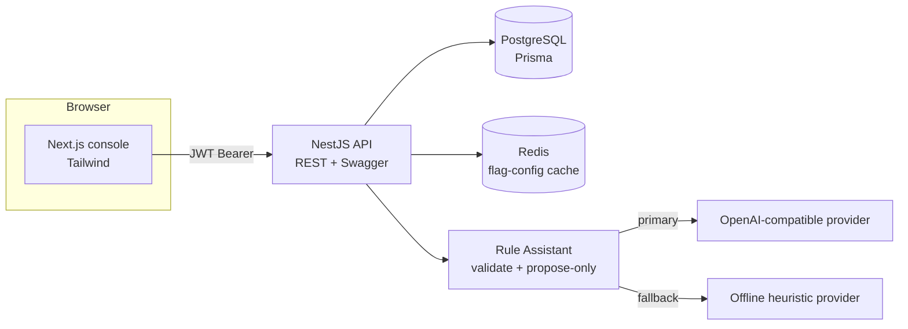
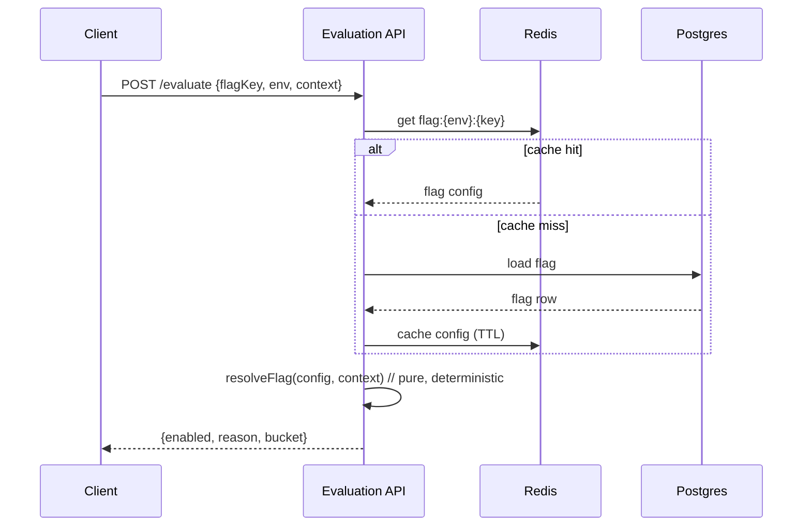

# Feature Flag & Configuration Platform

A small but production-minded platform for managing feature flags across environments,
evaluating them for a given user context, and auditing every change. It includes a
JWT-secured NestJS API, a Next.js operations console, PostgreSQL persistence, Redis
caching, and an AI "rule assistant" that turns plain English into a **proposed**
rollout rule for a human to review.

Built for the Senior Full Stack Developer take-home. Stack: **NestJS + Prisma +
PostgreSQL + Redis** on the backend, **Next.js (App Router) + Tailwind** on the
frontend, wired together with **Docker Compose**.

---

## Contents

- [What it does](#what-it-does)
- [Why this stack](#why-this-stack)
- [Architecture](#architecture)
- [Run it (Docker — one command)](#run-it-docker--one-command)
- [Run it (manual / local dev)](#run-it-manual--local-dev)
- [Demo accounts](#demo-accounts)
- [API & docs](#api--docs)
- [How evaluation works](#how-evaluation-works)
- [Concurrency & caching](#concurrency--caching)
- [The AI rule assistant](#the-ai-rule-assistant)
- [Security](#security)
- [Tests](#tests)
- [Trade-offs & what I'd do next](#trade-offs--what-id-do-next)
- [Production readiness](#production-readiness)
- [AI tooling disclosure](#ai-tooling-disclosure)

---

## What it does

The platform lets an **ADMIN** create and configure flags per environment (DEV / PROD)
and lets any authenticated user (**ADMIN** or **VIEWER**) read flag state and evaluate
flags. Two strategies are supported: a simple **BOOLEAN** on/off, and a
**PERCENTAGE_ROLLOUT** that enables a flag for a deterministic, consistent slice of
users, optionally constrained by city or by excluding internal users. Every write is
recorded in an append-only audit trail, and the evaluation endpoint answers not just
*whether* a flag is on for a user but *why*.

The console surfaces all of this: a flags dashboard with live status and rollout
meters, create/edit screens with validation and safe-concurrent saves, an evaluation
playground, and an audit view with before/after diffs.

## Why this stack

**NestJS over bare Express** because the brief asks for a framework with a clear
architecture: Nest's module/provider model gives real boundaries (`auth`, `flags`,
`evaluation`, `audit`, `ai`) and first-class dependency injection, which is exactly what
makes the AI provider swap and the graceful cache fallback clean to express *and* to test.
**Prisma** for type-safe data access and, importantly, first-class versioned migrations —
the optimistic-locking update is expressed directly as a version-scoped write.
**PostgreSQL** as the relational system of record, with JSONB for flag constraints so
targeting rules stay flexible without a schema change per rule shape. **Redis** for the
evaluation read path with an explicit, observable invalidation strategy, plus a graceful
in-process bypass when it's absent, so the API never hard-depends on it. **Next.js (App
Router) + Tailwind** on the front end for typed, component-structured UI with a small,
consistent design system. **Docker Compose** ties it together so a reviewer runs everything
with one command.

## Architecture



The backend is organised into focused Nest modules — `auth`, `flags`, `evaluation`,
`audit`, `ai`, plus `prisma` and `cache` infrastructure. The pure evaluation decision
logic lives in a dependency-free module (`evaluation/evaluation.logic.ts`) so it can be
unit-tested in isolation and reused anywhere.



## Run it (Docker — one command)

Requires Docker and Docker Compose.

```bash
docker compose up --build
```

That starts Postgres, Redis, the API, and the console. On start the backend applies
migrations and seeds demo data automatically. When it's up:

- Console: **http://localhost:3000**
- API + Swagger: **http://localhost:3001/api/docs**

To try the platform with a real LLM instead of the offline heuristic, export a key
before starting (optional):

```bash
export OPENAI_API_KEY=sk-...        # any OpenAI-compatible key
docker compose up --build
```

## Run it (manual / local dev)

You need Node 20+ and a reachable PostgreSQL and (optionally) Redis.

**Backend**

```bash
cd backend
cp .env.example .env                 # adjust DATABASE_URL / REDIS_URL if needed
npm install
npx prisma generate
npx prisma migrate deploy            # apply schema
npm run prisma:seed                  # demo users, envs, flags
npm run start:dev                    # http://localhost:3001
```

**Frontend**

```bash
cd frontend
cp .env.example .env.local           # NEXT_PUBLIC_API_URL=http://localhost:3001
npm install
npm run dev                          # http://localhost:3000
```

## Demo accounts

| Email             | Password    | Role   |
|-------------------|-------------|--------|
| admin@ff.local    | admin123    | ADMIN  |
| viewer@ff.local   | viewer123   | VIEWER |

The VIEWER account can read and evaluate but cannot create, edit, or delete — a good
way to see role enforcement (writes return `403`).

## API & docs

Interactive OpenAPI docs are served at **`/api/docs`**. Key endpoints:

| Method & path              | Role    | Purpose                                            |
|----------------------------|---------|----------------------------------------------------|
| `POST /auth/login`         | public  | Exchange credentials for a JWT                     |
| `GET  /flags`              | any     | List flags (paginated, `?environment=` filter)     |
| `POST /flags`              | ADMIN   | Create a flag                                       |
| `PATCH /flags/:id`         | ADMIN   | Update a flag (optimistic concurrency)              |
| `DELETE /flags/:id`        | ADMIN   | Delete a flag                                       |
| `POST /evaluate`           | any     | Resolve a flag for a user context                   |
| `GET  /audit`              | any     | Read the append-only audit trail (paginated)        |
| `POST /ai/rule-proposals`  | ADMIN   | Propose a structured rule from natural language     |
| `GET  /environments`       | any     | List environments                                   |

Errors use one consistent envelope and never leak a stack trace:

```json
{ "statusCode": 409, "error": "Conflict", "message": "Stale update: ...",
  "path": "/flags/abc", "requestId": "…", "timestamp": "…" }
```

Every request is tagged with an `x-request-id` (generated if absent, echoed back on the
response) and logged as a single structured line with method, path, status, and duration.

## How evaluation works

Evaluation is a pure function of a flag's config and a user context, which keeps it fast,
deterministic, and testable:

1. If the flag is disabled → off (`FLAG_DISABLED`).
2. `BOOLEAN` → on (`BOOLEAN_ENABLED`).
3. `PERCENTAGE_ROLLOUT`:
   - if the flag excludes internal users and the context is internal → off (`EXCLUDED_INTERNAL`);
   - if the flag limits to certain cities and the user isn't in one → off (`CITY_NOT_INCLUDED`);
   - otherwise compute a **stable bucket** and compare to the rollout percentage.

**Consistent bucketing.** The bucket is `sha256("{flagKey}:{userId}") mod 100`. Because
it's a hash of the flag key *and* the user id, a given user always lands in the same
bucket for a given flag (so they don't flicker in and out across requests or instances),
while the same user is decorrelated across different flags (being in the 10% for flag A
tells you nothing about flag B). At 0% nobody is in; at 100% everybody is.

## Concurrency & caching

**Optimistic concurrency.** Each flag carries a `version`. An update must send the
`expectedVersion` it last saw; the `UPDATE` is scoped to `WHERE id = … AND version = …`
and increments the version atomically. If another writer got there first the row no
longer matches, Prisma raises `P2025`, and the API returns `409 Conflict` instead of
silently overwriting. The console catches this and asks the user to reload — no lost
updates.

**Caching + invalidation.** The evaluation hot-path reads a flag's config from Redis
(`flag:{env}:{key}`) and falls back to Postgres on a miss, caching the result with a TTL.
Any write to a flag deletes its cache key (delete-on-write), so evaluations pick up the
new config immediately. If Redis is unavailable the cache layer degrades gracefully —
reads simply go to the database and the API keeps working.

## The AI rule assistant

An ADMIN can describe a rollout in plain English — *"enable for 20% of users in Harare
except internal staff"* — and get back a **structured proposal** that maps directly onto
a flag's fields. It is deliberately conservative:

- **Provider abstraction.** A `RuleProvider` interface has two implementations: an
  OpenAI-compatible provider (configured entirely by env, JSON-only, with a
  prompt-injection guard in the system message and an abort timeout) and an offline
  heuristic provider with no dependencies.
- **Graceful fallback.** If no API key is set, or the provider errors or times out, the
  service falls back to the heuristic and says so in a warning. The feature therefore
  works with **no key and no network**.
- **Validated, never trusted.** Raw model output is validated against a strict schema
  (`RuleProposalDto`). Invalid output is regenerated deterministically rather than shown.
- **Propose-only.** The endpoint never writes anything. The console shows the raw output
  and the structured proposal; a human clicks *Apply to form*, reviews, and saves through
  the normal flags API. The AI can suggest, but a person commits.

## Security

Passwords are hashed with bcrypt and never returned. Login gives the same error whether
the email is unknown or the password is wrong (no user enumeration). Access is via signed
JWTs; the secret comes from the environment. Authorization is role-based — reads are open
to any authenticated user, writes are ADMIN-only, enforced by a guard. All input is
validated at the edge with a global pipe that strips unknown properties. No secrets are
committed: `.env` is git-ignored and `.env.example` files ship with safe placeholders.

## Tests

```bash
# Backend
cd backend
npx prisma generate       # once, so the Prisma client + enums exist
npm test                  # unit tests
npm run test:e2e          # API tests (needs a reachable Postgres)

# Frontend
cd frontend
npm test                  # component + logic unit tests (jsdom)
```

The suite covers the parts most worth protecting, on both sides:

- **Evaluation logic** — determinism, `[0,100)` range, roughly uniform distribution,
  per-user consistency, the 0% / 100% boundaries, and each constraint path.
- **Optimistic locking** — a stale update is rejected with `409`, and a successful update
  increments the version, writes an audit record, and invalidates the cache.
- **AI (mocked provider)** — a valid provider response is returned as-is; a throwing
  provider triggers the offline fallback with a warning; invalid model output is rejected
  and regenerated rather than surfaced.
- **Frontend** — the rule-building helper (city parsing, trimming, optional constraints)
  and the status components (off / on / rollout %, strategy badge, environment tag) render
  the states the dashboard relies on.

## Trade-offs & what I'd do next

This is a vertical slice, so some things are intentionally scoped down. Evaluation
requires a JWT for simplicity; a production flag service would issue scoped SDK/API keys
for server-to-server evaluation and separate that path from the human console. The cache
uses delete-on-write, which is correct for a low-write config store; a very high-write
setup might prefer versioned keys or pub/sub invalidation across instances. Targeting is
limited to city and an internal flag; a fuller system would support arbitrary attribute
rules and segments. And the audit trail is append-only at the application layer — I'd add
a database-level guard (revoked update/delete grants) to make immutability enforced, not
just conventional. Given more time I'd also add refresh tokens, rate limiting on
`/auth/login` and `/ai`, and a small metrics endpoint.

## Production readiness

What this slice already does well and what would need to change to run it for real.

**Scaling.** The API is stateless, so it scales horizontally behind a load balancer;
Postgres and Redis are the shared state. The evaluation path is the one that must stay
fast under load: it reads a small flag config from Redis and then does a pure in-memory
hash, so it needs no per-user storage and no per-request database hit once warm. At larger
scale I'd front evaluation with scoped SDK keys rather than user JWTs, add read replicas
for the admin/read traffic, and consider pushing flag configs to edge caches so evaluation
never leaves the region. The first thing to break under real traffic would be per-instance
cache staleness across many nodes, which I'd solve with pub/sub (Redis keyspace events or a
`flag-changed` channel) so a write invalidates every instance, not just the one that served it.

**Observability.** Every request carries an `x-request-id` (generated or propagated) and
emits a structured log line with method, path, status, and duration; unexpected errors are
logged server-side with their stack while the client only sees a safe envelope. For
production I'd ship those logs as JSON to a central store, add a `/health` (liveness) and
`/ready` (readiness — DB + Redis reachable) endpoint for orchestrators, export Prometheus
metrics (evaluation count per flag/result, AI latency and fallback rate, cache hit ratio),
and trace the evaluate and AI calls with OpenTelemetry.

**Security.** Passwords are bcrypt-hashed, login avoids user enumeration, JWTs are signed
from an env secret, writes are ADMIN-only behind a role guard, and all input is validated
and whitelisted at the edge. Before production I'd rotate to a strong per-environment
`JWT_SECRET` from a secrets manager (not env files), add refresh tokens and short access-token
TTLs, rate-limit `/auth/login` and `/ai/rule-proposals`, set security headers and a strict
CORS allow-list, and keep the prompt-injection guard already present on the AI provider.
The AI path never sends secrets to the model and never persists model output without schema
validation and a human save.

**Data backup & recovery.** Postgres is the system of record and the audit trail is the
compliance-critical table. I'd run automated daily base backups plus WAL archiving for
point-in-time recovery, test restores on a schedule, and enforce audit immutability at the
database level by revoking UPDATE/DELETE on `AuditLog` from the application role (append-only
in practice, not just by convention). Redis holds only derived cache data, so it needs no
backup — a cold cache simply repopulates from Postgres. Migrations are versioned and applied
with `prisma migrate deploy`, so schema changes roll forward reproducibly.

**Deployment.** Both services are containerised and run together with one Compose command
for review. For production I'd build immutable images in CI, run the test suite and
`prisma migrate deploy` as pipeline stages, and deploy to a managed orchestrator (ECS or
Kubernetes) with managed Postgres and Redis, health-check-gated rolling releases, and secrets
injected at runtime rather than baked into images. The frontend would build once per
environment (since `NEXT_PUBLIC_*` is inlined) or move to runtime config for a single image.

## AI tooling disclosure

Per Section 12: I used Claude (Anthropic) as an AI coding assistant during development —
for scaffolding, drafting implementation across the stack, and documentation. The
engineering decisions in this solution are mine and I can defend each of them: a rollout
bucket that hashes `{flagKey}:{userId}` so assignment is consistent per user yet
decorrelated across flags; a version-scoped update that converts a stale write into a
`409` instead of a silent overwrite; an AI path that is strictly propose-only behind a
validated schema; and graceful degradation when Redis or the model provider is
unavailable. I have reviewed every file in the repository and can explain, debug, and
modify any part of it during the review.
